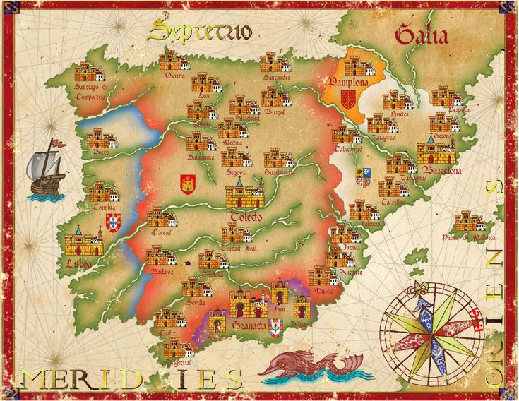

***

## Un peu de contexte historique...

Tous les personnages d'*Aquelarre* sont nés ou ont grandi dans l'un des cinq royaumes composant la péninsule ibérique au XIVe siècle. Ces cinq royaumes, que sont Castille, Aragon, Navarre, Portugal, et Grenade, ont des relations plus ou moins tourmentées.

Un peu de contexte historique avant tout. A l'époque ou se déroule le jeu, cela fait près de 800 ans que l'Espagne est au moins partiellement sous le contrôle de royaumes musulmans. Mais la situation est en passe de changer. Les royaumes catholiques, qui deviendront la Castille, l'Aragon et la Navarre,
étaient auparavant cantonnées aux montagnes du Nord de la péninsule, et ont résisté tant bien que mal aux attaques incessantes des puissants royaumes musulmans du Sud. 

Il y a 200 ans, au début du XIIe siècle, ils se sont mis sur l'offensive. En 1212, ils remportèrent une écrasante victoire sur le califat almohade et conquièrent la moitié sud de l'Espagne. Toute la moitié sud? Non, car un ~~village d'irréductibles gaulois~~ royaume d'irréductibles musulmans résistent encore et toujours à l'avancée catholique: le royaume de Grenade. Retranchés dans les montagnes du sud du pays, ils forment le bastion final des musulmans en Espagne,
dernier vestige de 800 ans de civilisation. Ils finiront par succomber aux attaques du royaume de Castille en 1492, mais c'est une autre histoire...

***

## Etape 1: D'ou venez-vous ? - Page 27

La première étape de la création de personnage est de choisir votre royaume d'origine. Celui-ci déterminera la langue que vous parlez, votre culture et votre religion.

### Couronne de Castille

La Castille est le plus grand et le plus puissant des royaumes ibériques, et possède une influence culturelle et politiaue majeure sur le reste des états. Au sein de ses frontières, on trouve de nombreux royaumes autrefois indépendants,
tels que Léon, Galice, Tolède, et Murcie, désormais tous liés à la couronne castillane.

Jusqu'à récemment, la Castille entretenait des relations houleuses avec la couronne d'Aragon jusqu'à la récente signature du compromis de Caspe en 1412 et la venue d'une dynastie castillaine, les Trastámara, sur le trône d'Aragon. De même avec le royaume de Grenade, sur qui les rois de Castille ont des vues. A l'inverse, ils ont des trés bons rapports avec leurs voisins portugais et navarrois.

Si votre personnage vient de cette région, il peut être issu de l'une des communautés suivantes:

**- Castillan**

**- Galicien**

**- Basque**

**- Astur-léonais**

**- Mudejar**

**- Juif**

### Couronne d'Aragon

Crée en 1150 par l'union du royaume d'Aragon et du comté de Barcelone, ce royaume s'est récemment doté d'un véritable empire en Méditerranée et s'est étendu pour englober la côte sud-est de la péninsule ibérique, les îles Baléares, la Sicile, la Corse, et le sud de l'italie. Davantage porté sur la mer que son grand rival la Castille, la couronne d'Aragon a centré sa politique sur le commerce maritime. Même s'il demeure moins puissant que son voisin, le dynamisme commercial de l'Aragon lui donne un poids important dans les affaires politiques.

Si votre personnage est issu de l'Aragon, il peut être issu de l'une des communautés suivantes:

**- Aragonais**

**- Catalan**

**- Mudejar**

**- Juif**

### Royaume de Navarre

Faisant suite à deux siècles d'émiettement, le royaume de Navarre est le plus petit des 5 royaumes. Gouvernée par une dynastie française, elle maintient pourtant de bonnes relations avec ses deux voisins, 
la Castille et l'Aragon, servant d'état tampon entre les deux. Toutefois, les voix des partisans d'un rattachement de la Navarre à l'un ou l'autre des camps montent, et le spectre d'une guerre civile approche.

Si votre personnage vient du royaume de Navarre, vous avez le choix entre les communautés suivantes:

**- Navarrois**

**- Juif**

**- Basque**

### Royaume du Portugal

Il y a deux siècles, le comte du Portugal s'est érigé en royaume, contrôlant la partie ouest de la péninsule. Au XIVe siècle, elle est une alliée solide de la Castille. Les priorités du roi du Portugal sont de mettre fin aux veilleités autonomistes des nobles de son royaume et
faire prospérer son petit royaume. Peut-être que l'expansion outre-mer aiderait le Portugal à se faire sa place dans le bal des nations...