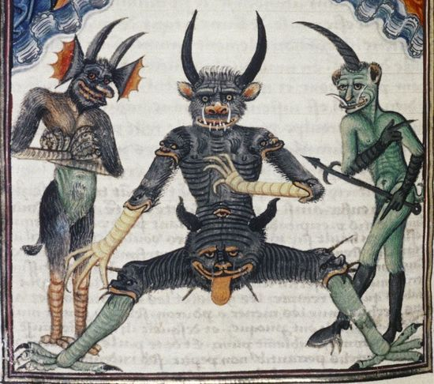

Ce site web contient des extraits sélectionnés du JDR espagnol *Aquelarre*. Vous trouverez dans ces pages des instructions pour la création de personnages, des listes de sorts et d'armures, et des illustrations des principaux concepts de jeu en français. Les numéros de pages entre [crochets]. réfèrent à l'édition en langue anglaise du manuel du joueur.

***

 Note : Etant donné qu'une traduction du jeu en français n'est pas (encore) disponible, ce site web est une tentative de partager des éléments du jeu avec un public francophone et de servir d'aide de jeu facilement disponible. Ce site, à but non-lucratif, ne contient pas de copies du livre et n'a pas pour but de violer les droits des détenteurs des droits d'auteur. Il a pour vocation d'être utilisé en conjonction avec le livre, disponible à l'achat en anglais sur [DriveThruRPG](https://www.drivethrurpg.com/product/237059/Aquelarre?cPath=5328_24247) 

